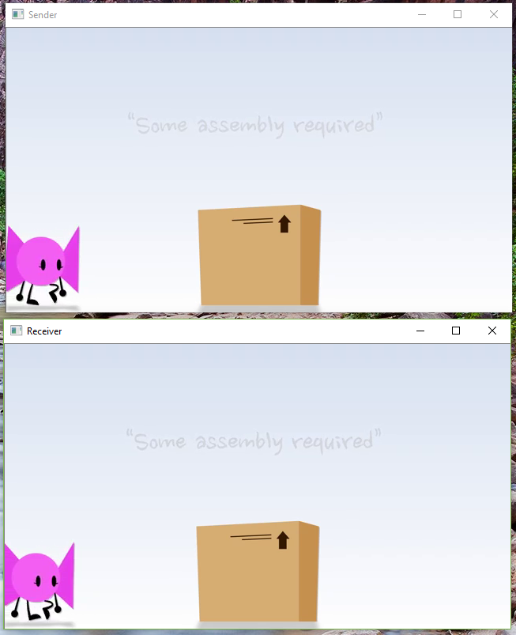

# OpenCV-SharedMemory

  Shares an OpenCV image between two programs using Shared Memory on Windows.  
  Useful for using with GigE (eg: Basler) cameras if you need the same video in multiple programs but lack multi-cast hardware.  
  Relevant code can be found in [OpenCV-SharedMemory.cpp](OpenCV-SharedMemory/OpenCV-SharedMemory.cpp): server() and receiver().

  

## Run Demo
  - Clone respository
  - Launch Release/Server.exe
  - Launch Release/Receiver.exe
  - Press any key inside video window to quit (or wait for video to finish)

## Test code
  - Clone respository
  - Make sure OpenCV is installed. This Visual Studio Solution is configured for VS2017 and OpenCV 3.3.0.
  - Copy video.mp4 (Courtesy https://www.youtube.com/watch?v=GiJ6RmjJt8g) to the folder with .cpp files
  - Launch OpenCV-SharedMemory.sln
  - Configure Project properties to current version of OpenCV.
  - Run the program. Pressing "S" launches the server.
  - Run another copy of the program. Press "R" to launch the receiver.
  - Press any key inside video window to quit (or wait for video to finish)

# Summary
  - A mutex is created to lock the memory buffer during reads and writes.
  - A shared buffer of size Channels * Height * Width bytes is created to store the image.
  - Make sure the image [isContinuous()](https://docs.opencv.org/2.4/modules/core/doc/basic_structures.html#bool%20Mat::isContinuous()%20const)
    - If not, use clone() to copy the image to a new cv::Mat where it is continuous. 

  - LockMutex  
  - Sender: The image is copied using the pointer to the first byte cv::Mat.ptr() to the shared memory.  
  - Receiver: A new mat is created to store an image of the same [CvType](https://docs.opencv.org/java/2.4.9/org/opencv/core/CvType.html#CV_16S) as that in sender (also match step), with its data pointer pointing to the shared memory.  
  - ReleaseMutex 
